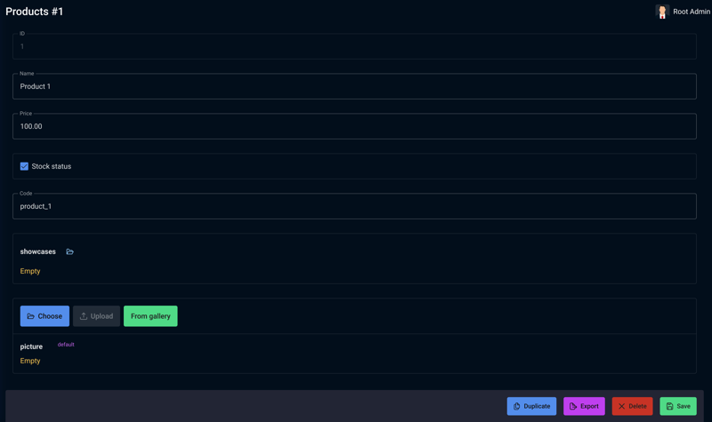
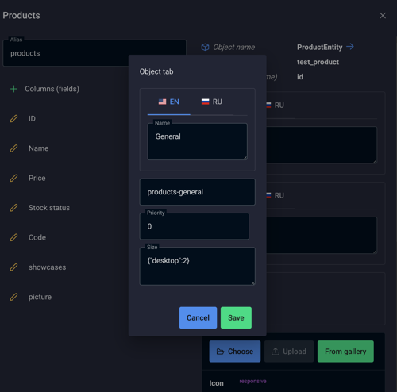
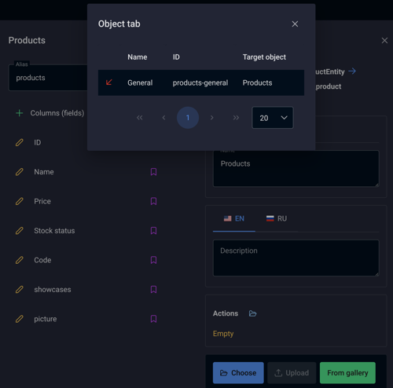
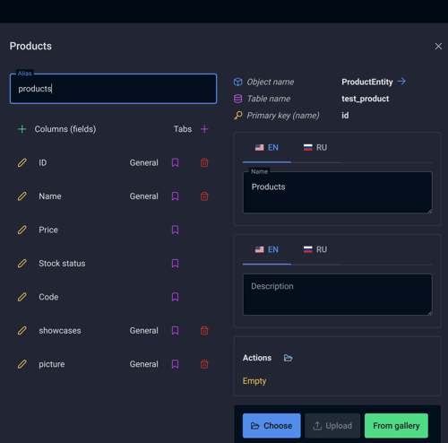
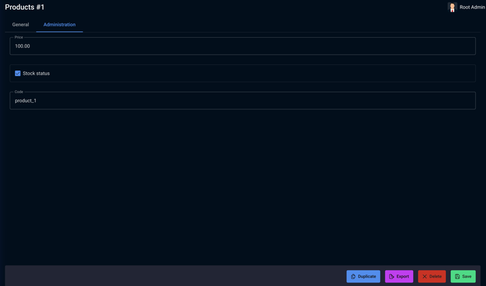

# Explorer

## General
This module automates the data management of DB entities by automatically generating user interfaces for their administration. It analyses the structure of database entities and creates metadata for data display, link lookup, page navigation and filtering. The module also provides advanced rendering settings and a flexible API for complete customisation of interface components.

Next, we will look at the explorer module on a small example in order to get a clear idea of its capabilities.

Let's create a simple object and connect it to ORM:

    @Entity("test_product")
    export class ProductEntity {
        @PrimaryGeneratedColumn({ zerofill: true })
        id: number;
        
        @Index({ unique: true })
        @Column("varchar", { nullable: true })
        code: string;
        
        @Column("varchar", { nullable: true })
        name: string;
        
        @Index()
        @Column("decimal", { unsigned: true, precision: 10, scale: 2, default: 0 })
        price: number;
        
        @Index()
        @Column("boolean", { name: "in_stock", default: true })
        inStock: boolean;
    }    

After that, let's go to `/system/entities`, and find it there:

In the entity editor, we can observe the structure of the entity:

In the entity column editor, we can observe some metadata:

## Sections and Objects
In the entity editor, click on the arrow next to the entity's name or go to `/section/ProductEntity`:

The section will display a list of entity records, click `Create` and create multiple records:

To speed up the creation process, use the `Duplicate' button in the object's user interface to create a copy of an existing record. As a result, the list of this section will look as follows:

You can customise the appearance of this section, for example, give names to the columns or change their order. To do this, go to `/system/entities` section, find our `ProductEntity` there. In the entity editor you can fill in the name of the entity in the `Name` field, then go to the editor of each column and change the value in the `Section priority` field, according to the order of the columns in the list. The larger the value is, the more to the left the column will be. Here in the `Name` field you can also set a name for each column. The edited parameters can give this appearance:

The data in the list can be filtered and sorted using the icon to the right of the column name:

The window with filtering parameters looks like this:

Note that the URL string contains the filtering options after setting the sort and filter values for the list columns: `/section/ProductEntity?page=1&filter=::name:%257%25::code:%25pro%25::inStock:true&sort=name&order=ASC`

Before we go any further, let's add another test entity to the project:

    @Entity("test_product_showcases")
    export class ProductShowcaseEntity {
        @PrimaryGeneratedColumn({ zerofill: true })
        id: number;
        
        @Index({ unique: true })
        @Column("varchar", { nullable: true })
        code: string;
        
        @ManyToMany(() => LocalizedStringEntity, { cascade: true })
        @JoinTable()
        name: LocalizedStringEntity[];
    }

Now let's extend our `ProductEntity` by adding `picture` fields to store the product image and a `showcases` field to store the newly created `ProductShowcaseEntity`:

    @Entity("test_product")
    export class ProductEntity {
        @PrimaryGeneratedColumn({ zerofill: true })
        id: number;
        
        @Index({ unique: true })
        @Column("varchar", { nullable: true })
        code: string;
        
        @Column("varchar", { nullable: true })
        name: string;
        
        @Index()
        @Column("decimal", { unsigned: true, precision: 10, scale: 2, default: 0 })
        price: number;
        
        @Index()
        @Column("boolean", { name: "in_stock", default: true })
        inStock: boolean;
        
        @ManyToOne(() => MediaEntity, (t) => t.code)
        picture: MediaEntity;
        
        @ManyToMany(() => ProductShowcaseEntity, { cascade: true })
        @JoinTable()
        showcases: ProductShowcaseEntity[];
    }

Let's go to `/system/entities` section and make sure that `ProductShowcaseEntity` has appeared, as well as open the `ProductEntity` entity editor and make sure that new columns have appeared. Let's go to `/section/ProductEntity` and make sure that the new columns appear. Next, go to `/section/ProductShowcaseEntity` and create some items:

For convenience and quick access to these two sections, let's expand the main menu, to do this let's use the `/section/categories` section and create the appropriate categories for the tree with the main menu, or just import this XML configuration, in section `/system/import-data`:

    <InsertUpdate target="LocalizedStringEntity">
        <row>
            <lang key="id">en</lang>
            <code>a-menu-products-name-en</code>
            <value>Products</value>
        </row>
        <row>
            <lang key="id">ru</lang>
            <code>a-menu-products-name-ru</code>
            <value>Продукты</value>
        </row>
        <row>
            <lang key="id">en</lang>
            <code>a-menu-products-list-name-en</code>
            <value>Product list</value>
        </row>
        <row>
            <lang key="id">ru</lang>
            <code>a-menu-products-list-name-ru</code>
            <value>Список товаров</value>
        </row>
        <row>
            <lang key="id">en</lang>
            <code>a-menu-products-showcases-name-en</code>
            <value>Product showcases</value>
        </row>
        <row>
            <lang key="id">ru</lang>
            <code>a-menu-products-showcases-name-ru</code>
            <value>Эмблемы товаров</value>
        </row>
    </InsertUpdate>

    <InsertUpdate target="CategoryEntity">
        <row>
            <code>a-menu-products</code>
            <parent key="code">a-menu-root</parent>
            <name key="code">
                <row>a-menu-products-name-ru</row>
                <row>a-menu-products-name-en</row>
            </name>
        </row>
        <row>
            <code>a-menu-products-list</code>
            <url>/section/products</url>
            <parent key="code">a-menu-products</parent>
            <priority>2</priority>
            <name key="code">
                <row>a-menu-products-list-name-ru</row>
                <row>a-menu-products-list-name-en</row>
            </name>
        </row>
        <row>
            <code>a-menu-products-showcases</code>
            <url>/section/products-showcases</url>
            <parent key="code">a-menu-products</parent>
            <priority>3</priority>
            <name key="code">
                <row>a-menu-products-showcases-name-ru</row>
                <row>a-menu-products-showcases-name-en</row>
            </name>
        </row>
    </InsertUpdate>

Let's refresh the page and see that there are new items in the menu:

Let's try to go for example to the link of one of the added items `/section/products` and get the error `Not Found 404`, because this link is different from `/section/ProductEntity`. To make our beautiful link work, we need to go to the `/system/entities` section, find `ProductEntity` there and set value `products` in the `Alias` field and in the `ProductShowcaseEntity` set `products-showcases` respectively. Now the links in the main menu `section/products` and `/section/products-showcases` will work.

## Objects

Let's open any of the created products, for example `/object/products/1`, the UI looks like this:

Note that for all fields of the `ProductEntity` entity, the edit elements corresponding to their type are displayed in the form. The idea is that all the entity column data types in the database were analysed at the time of the system metadata synchronisation, and were reduced to more simplified types for use with explorer. By default, the system reduces these types to the default set of types: `string`, `number`, `boolean`, `date`, `reference`, `unknown`. Each type can be seen in the `Data type` field by opening the column editor, in the entity editor in the `/system/entities` list. Each default data type has its own default renderer (which will be discussed next), which visualises the corresponding entity edit form control. We have the option to extend the list of data types by adding our own, as well as to override the default renderer for a particular entity column, or to create our own custom renderer.

### Tabs

The entity UI allows you to split the form into tabs for ease of use. To do this, open the entity editor, create a new tab by pressing the corresponding `+` button:

Next, assign the tab to multiple fields of the entity:

After saving, go to UI edit entity record `/object/products/1`:

Note that all fields for which no tab was selected are moved to the `Administration` tab (this is the default tab). If there are hasn't fields without tabs, then the `Administration` tab will disappear. We can also see that the created `General` tab has two columns - this is adjusted in the `Size` field when creating the tab, here we see the parameters as a JSON string, where the parameter "desktop" sets the number of tabs for desktop devices, "tablet" - for tablets, and for smartphones there will always be one column. The `Priority` field here characterises the order of tabs.

## Renderers
todo

### Default renderers
// describe all default renderers

#### Section renderers
todo

#### Object renderers
todo

### Custom renderers
todo
// custom renderer example

### Virtual columns
todo

## Actions
todo

### Default actions
todo

### Custom actions
todo

